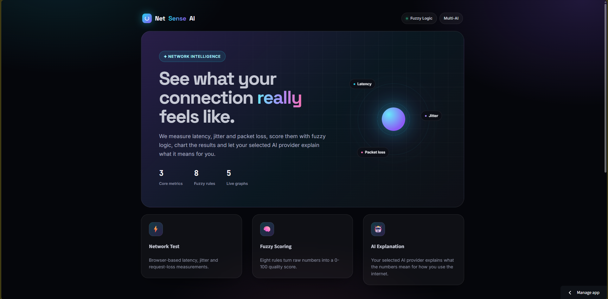
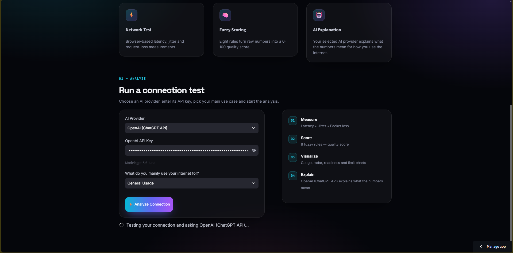
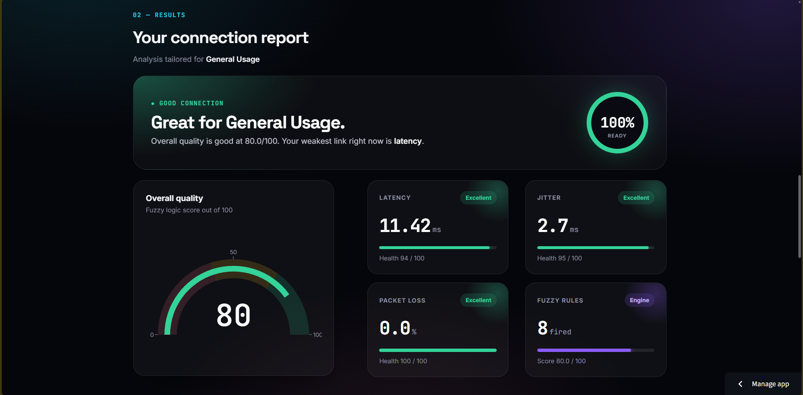
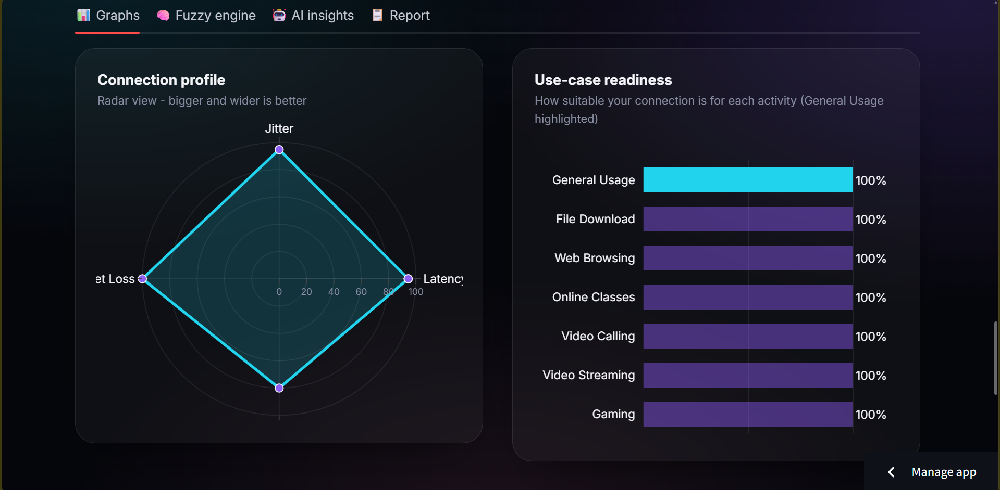
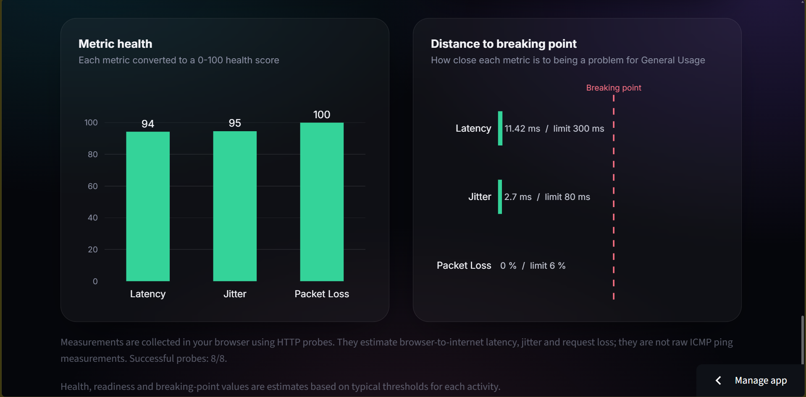
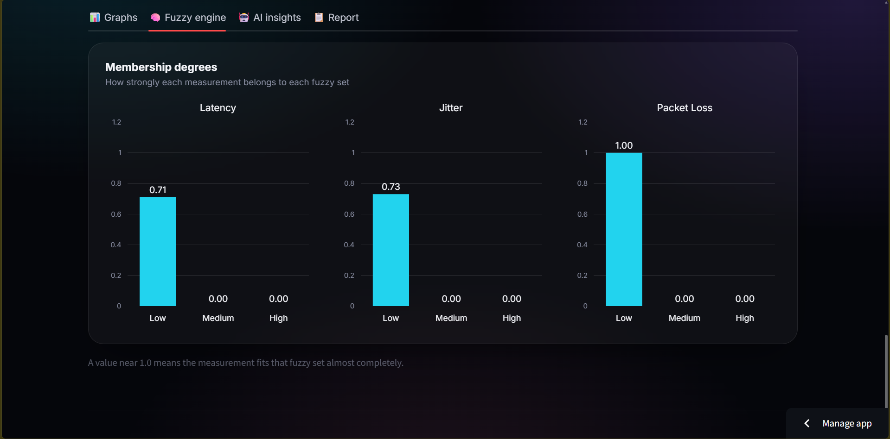
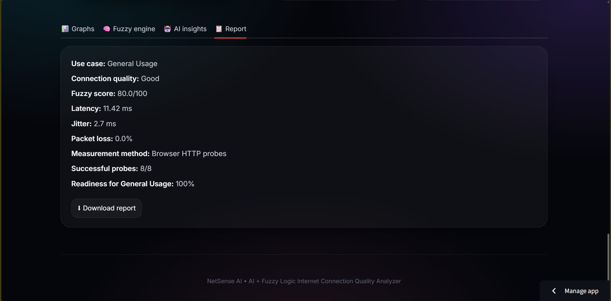

# 🚀 NetSense AI

### AI-Based Internet Connection Quality Analyzer using AI/LLM (LangChain) + Fuzzy Logic

**NetSense AI** is a web-based application that analyzes Internet connection quality using **Latency, Jitter, and Packet Loss**.

The project combines **Fuzzy Logic** with **AI/LLM using LangChain** to calculate an Internet quality score, identify connection quality, analyze different internet use cases, and provide AI-generated recommendations.

Users can choose their preferred AI provider and enter their own API key directly in the application.

Supported AI providers include:

* **OpenAI**
* **Google Gemini**
* **Groq**

---

## 🌐 Live Deployment

🚀 **Try NetSense AI Online:**

**https://ai-internet-quality-analyzer.streamlit.app**

> The application is deployed using **Streamlit Community Cloud**.

---

## ✨ Main Features

* 📡 **Latency Analysis**
* 📶 **Jitter Analysis**
* 📦 **Packet Loss Analysis**
* 🧠 **Fuzzy Logic-based Quality Scoring**
* 🤖 **AI/LLM Analysis using LangChain**
* 🔀 **Multiple AI Provider Support**
* 🔑 **User-provided API Key**
* 🎮 **Gaming Analysis**
* 📞 **Video Call Analysis**
* 📺 **Video Streaming Analysis**
* 🎓 **Online Classes Analysis**
* 🌐 **Web Browsing Analysis**
* 📥 **File Download Analysis**
* 💻 **General Usage Analysis**
* 📊 **Interactive Network Results Dashboard**
* 📈 **Fuzzy Membership Visualization**
* 💡 **AI-generated Recommendations**
* ☁️ **Public Streamlit Deployment**

---

## 🤖 Supported AI Providers

NetSense AI allows users to select the AI provider they want to use.

### OpenAI

**Provider:**

```text
OpenAI (ChatGPT API)
```

**API Key:**

```text
OPENAI_API_KEY=YOUR_OPENAI_API_KEY
```

**Model:**

```text
gpt-5.6-luna
```

---

### Google Gemini

**Provider:**

```text
Google Gemini
```

**API Key:**

```text
GOOGLE_API_KEY=YOUR_GOOGLE_API_KEY
```

**Model:**

```text
gemini-3.8-flash
```

---

### Groq

**Provider:**

```text
Groq
```

**API Key:**

```text
GROQ_API_KEY=YOUR_GROQ_API_KEY
```

**Model:**

```text
openai/gpt-oss-20b
```

---

## 🔑 API Key Selection

Users do not need to store an API key inside the source code.

When using NetSense AI, the user can:

1. Select an **AI Provider**
2. Enter the API key for that provider
3. Run the Internet quality test
4. Generate AI-powered analysis and recommendations

Example:

```text
AI Provider
    ↓
OpenAI / Gemini / Groq
    ↓
Enter API Key
    ↓
Select Internet Usage
    ↓
Run Network Test
    ↓
AI Analysis & Recommendations
```

> API keys entered by users should never be committed to GitHub or included directly in the source code.

---

## 🛠️ Technologies / Tech Stack

### Application Interface

* Python
* Streamlit

### Fuzzy Logic

* scikit-fuzzy
* NumPy
* SciPy

### AI / LLM

* LangChain
* OpenAI
* Google Gemini
* Groq

### Network Testing

* ICMP Ping
* Latency Measurement
* Jitter Calculation
* Packet Loss Measurement

### Development & Deployment

* VS Code
* Git
* GitHub
* Streamlit Community Cloud

---

## 🧠 How It Works

```text
                Internet Connection
                        ↓
             Network Performance Test
                        ↓
        ┌───────────────┼───────────────┐
        ↓               ↓               ↓
     Latency          Jitter       Packet Loss
        └───────────────┼───────────────┘
                        ↓
                  Fuzzy Logic
                        ↓
             Quality Score + Category
                        ↓
                Select AI Provider
                        ↓
          OpenAI / Gemini / Groq
                        ↓
               LangChain + LLM
                        ↓
             AI Analysis & Insights
                        ↓
            Recommendations for User
```

The application first measures key network parameters such as **latency, jitter, and packet loss**.

These values are processed through the **Fuzzy Logic engine**, which generates an overall Internet quality score and connection quality category.

The user then selects an AI provider and enters their own API key.

LangChain connects the selected AI model with the network analysis and generates recommendations based on the user's Internet connection and selected usage type.

---

## 🌐 Internet Usage Analysis

NetSense AI allows users to select what they mainly use their Internet connection for.

Available options include:

* 🎮 **Gaming**
* 📞 **Video Call**
* 📺 **Video Streaming**
* 🎓 **Online Classes**
* 🌐 **Web Browsing**
* 📥 **File Download**
* 💻 **General Usage**

The AI analysis changes according to the selected Internet usage.

For example, a connection suitable for general browsing may not provide the same experience for gaming or video calls.

---

## 📁 Project Structure

```text
AI-Internet-Quality-Analyzer/
│
├── backend/
│   ├── ai_analyzer.py
│   └── fuzzy_logic.py
│
├── screenshots/
│   ├── homepage.png
│   ├── testing.png
│   ├── results.png
│   ├── graph1.png
│   ├── graph2.png
│   ├── fuzzyengine.png
│   ├── ainsights.png
│   └── report.png
│
├── streamlit_app.py
├── .gitignore
├── README.md
└── requirements.txt
```

---

## ⚙️ Installation & Setup

### 1. Clone the Repository

```bash
git clone https://github.com/Jeyasuriya-pillai/AI-Internet-Quality-Analyzer.git
```

Navigate to the project directory:

```bash
cd AI-Internet-Quality-Analyzer
```

---

### 2. Create a Virtual Environment

```bash
python -m venv venv
```

---

### 3. Activate the Virtual Environment

#### Windows PowerShell

```powershell
.\venv\Scripts\Activate.ps1
```

#### Windows Command Prompt

```cmd
venv\Scripts\activate
```

---

### 4. Install Dependencies

```bash
pip install -r requirements.txt
```

---

## 🔑 Environment Variables / API Key Placeholders

NetSense AI supports multiple AI providers.

The following placeholders can be used when configuring API keys through environment variables.

### OpenAI

```env
OPENAI_API_KEY=YOUR_OPENAI_API_KEY
```

### Google Gemini

```env
GOOGLE_API_KEY=YOUR_GOOGLE_API_KEY
```

### Groq

```env
GROQ_API_KEY=YOUR_GROQ_API_KEY
```

> Never add real API keys to the README or commit them to GitHub.

Recommended `.env` structure:

```env
OPENAI_API_KEY=YOUR_OPENAI_API_KEY
GOOGLE_API_KEY=YOUR_GOOGLE_API_KEY
GROQ_API_KEY=YOUR_GROQ_API_KEY
```

Add `.env` to `.gitignore`:

```text
.env
```

The application also allows users to enter their API key directly through the Streamlit interface.

---

## ▶️ How to Run the Project

From the project root directory, run:

```bash
python -m streamlit run streamlit_app.py
```

The application will be available locally at:

```text
http://localhost:8501
```

Open this URL in your browser.

---

## 🧪 How to Use NetSense AI

### Step 1 — Open the Application

Launch NetSense AI locally or open the live Streamlit deployment.

---

### Step 2 — Select an AI Provider

Select one of the available AI providers:

```text
OpenAI (ChatGPT API)
Google Gemini
Groq
```

---

### Step 3 — Enter Your API Key

Enter the API key corresponding to the selected provider.

Example:

```text
OpenAI API Key
Paste your OpenAI API key
```

The application uses the key only for generating AI analysis.

---

### Step 4 — Select Internet Usage

Choose what you mainly use your Internet connection for:

```text
Gaming
Video Call
Video Streaming
Online Classes
Web Browsing
File Download
General Usage
```

---

### Step 5 — Start Network Test

The application measures:

* Latency
* Jitter
* Packet Loss

---

### Step 6 — View Network Quality

The Fuzzy Logic engine processes the network values and generates:

* Overall Quality Score
* Connection Quality Category
* Individual Network Metric Analysis
* Fuzzy Membership Results

---

### Step 7 — Generate AI Analysis

The selected AI provider analyzes the network results.

Depending on the provider, NetSense AI uses:

| AI Provider       | Model                |
| ----------------- | -------------------- |
| **OpenAI**        | `gpt-5.6-luna`       |
| **Google Gemini** | `gemini-3.8-flash`   |
| **Groq**          | `openai/gpt-oss-20b` |

The AI generates:

* Connection Quality Explanation
* Selected Usage Analysis
* Potential Network Issues
* Performance Insights
* Improvement Recommendations

---

## 📸 Screenshots

### 🏠 Homepage

<p align="center">
  
</p>

### 🧪 Testing

<p align="center">
  
</p>

### 📊 Network Quality Result

<p align="center">
  
</p>

### 📈 Graphs & Visualizations

<p align="center">
  
  
</p>

### 🧠 Fuzzy Logic

<p align="center">
  
</p>

### 🤖 AI Insights

<p align="center">
  
</p>

### 📄 Report

<p align="center">
  
</p>

---

## 🚧 Project Status

**Active Development**

### Completed

* ✅ Network Testing
* ✅ Latency Measurement
* ✅ Jitter Measurement
* ✅ Packet Loss Measurement
* ✅ Fuzzy Logic Engine
* ✅ Internet Quality Score
* ✅ Quality Category
* ✅ LangChain Integration
* ✅ OpenAI Integration
* ✅ Google Gemini Integration
* ✅ Groq Integration
* ✅ Multiple AI Provider Selection
* ✅ User-provided API Keys
* ✅ Internet Usage Selection
* ✅ AI-generated Analysis
* ✅ AI Recommendations
* ✅ Streamlit Web Application
* ✅ Public Deployment

### Planned

* 🚧 Historical Network Monitoring
* 🚧 Download Speed Testing
* 🚧 Upload Speed Testing
* 🚧 Extended Network Reports

---

## 👨‍💻 Developer Information

| Information       | Details                                                                              |
| ----------------- | ------------------------------------------------------------------------------------ |
| **Name**          | Jeyasuriya                                                                           |
| **Roll No.**      | 19022                                                                                |
| **Course**        | B.Sc. Information Technology                                                         |
| **Project Title** | AI-Based Internet Connection Quality Analyzer using AI/LLM (LangChain) + Fuzzy Logic |

---

## 📌 Project Title

**AI-Based Internet Connection Quality Analyzer using AI/LLM (LangChain) + Fuzzy Logic**

---

## ⭐ NetSense AI

**Making Internet Quality Easier to Understand.**

⭐ If you find this project useful, consider giving the repository a star on GitHub.
